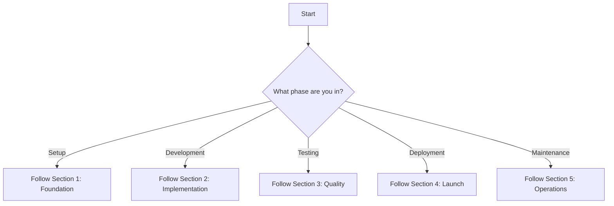

# ROKO Marketing Site - Master Project Manifest

## 🎯 Project Mission
Build a high-performance marketing website for ROKO Network that showcases temporal blockchain technology with nanosecond precision, featuring Web3 governance integration, developer tools, and premium visual experiences.

---

## 📋 Project Execution Framework

### Start Here - Decision Tree


---

## 1️⃣ FOUNDATION PHASE

### 1.1 Project Setup Checklist
```bash
# Execute these commands in order:
git clone https://github.com/Roko-Network/roko-marketing.git
cd roko-marketing
npm create vite@latest . -- --template react-ts
npm install
```

### 1.2 Required Documentation
Read these documents in this exact order:

1. **[PROJECT_GOVERNANCE.md](./PROJECT_GOVERNANCE.md)** - Governance framework and standards
   - Definition of Done criteria
   - RACI matrix
   - Development standards

2. **[COLOR_PALETTE_ANALYSIS.md](./COLOR_PALETTE_ANALYSIS.md)** - Official brand guidelines
   - Color values: #BAC0CC, #BCC1D1, #D9DBE3, #181818, #00d4aa
   - Typography: Rajdhani, HK Guise, Aeonik TRIAL
   - Implementation examples

3. **[UI_UX_SPECIFICATIONS.md](./UI_UX_SPECIFICATIONS.md)** - Complete design system
   - Component specifications (Sections 2-3)
   - Motion guidelines (Section 7)
   - Responsive breakpoints (Section 9)

### 1.3 Install Dependencies
```json
{
  "dependencies": {
    "react": "^18.2.0",
    "react-dom": "^18.2.0",
    "react-router-dom": "^6.20.0",
    "@react-three/fiber": "^8.15.0",
    "@react-three/drei": "^9.88.0",
    "three": "^0.159.0",
    "framer-motion": "^10.16.0",
    "wagmi": "^2.0.0",
    "viem": "^2.0.0",
    "@rainbow-me/rainbowkit": "^2.0.0",
    "zustand": "^4.4.0",
    "@tanstack/react-query": "^5.0.0"
  },
  "devDependencies": {
    "@types/react": "^18.2.0",
    "@types/three": "^0.159.0",
    "typescript": "^5.3.0",
    "vite": "^5.0.0",
    "vitest": "^1.0.0",
    "@playwright/test": "^1.40.0",
    "tailwindcss": "^3.3.0"
  }
}
```

---

## 2️⃣ IMPLEMENTATION PHASE

### 2.1 Development Order
Follow this exact sequence to build features:

#### Phase 1: Core Setup (Days 1-3)
Reference: **[DEVELOPMENT_HANDOVER.md](./DEVELOPMENT_HANDOVER.md)** Section 7

1. **Create folder structure:**
```
src/
├── components/
│   ├── common/
│   ├── layout/
│   ├── features/
│   └── three/
├── hooks/
├── stores/
├── styles/
├── utils/
└── types/
```

2. **Set up design tokens:**
```css
/* src/styles/tokens.css */
:root {
  /* Colors from COLOR_PALETTE_ANALYSIS.md */
  --roko-primary: #BAC0CC;
  --roko-secondary: #BCC1D1;
  --roko-tertiary: #D9DBE3;
  --roko-dark: #181818;
  --roko-teal: #00d4aa;
  --roko-teal-hover: #00ffcc;

  /* Typography from UI_UX_SPECIFICATIONS.md Section 6 */
  --font-display: 'Rajdhani', sans-serif;
  --font-body: 'HK Guise', sans-serif;
  --font-mono: 'JetBrains Mono', monospace;
}
```

3. **Load fonts:**
```html
<!-- index.html -->
<link href="https://fonts.googleapis.com/css2?family=Rajdhani:wght@300;400;500;600;700&display=swap" rel="stylesheet">
```

#### Phase 2: Components (Days 4-10)
Reference: **[REQUIREMENTS_SPECIFICATION.md](./REQUIREMENTS_SPECIFICATION.md)** Epics 1-3

Build components in this order:

1. **Navigation** (US-1.2)
   - Specs: UI_UX_SPECIFICATIONS.md Section 2.1
   - Acceptance criteria: Lines 176-183

2. **Hero Section** (US-1.1)
   - 3D Orb: UI_UX_SPECIFICATIONS.md Section 8.1
   - Acceptance criteria: Lines 151-159

3. **Technology Showcase** (US-2.1, US-2.2)
   - Comparison chart implementation
   - Network visualization

#### Phase 3: Web3 Integration (Days 11-15)
Reference: **[DAO_GOVERNANCE_SPECIFICATION.md](./DAO_GOVERNANCE_SPECIFICATION.md)**

1. **Wallet Connection** (US-7.1)
   - RainbowKit setup
   - Multi-chain support

2. **Staking Interface** (US-7.2)
   - pwROKO implementation
   - Gas estimation

3. **Voting System** (US-7.3)
   - Proposal display
   - Vote casting

#### Phase 4: 3D & Animations (Days 16-20)
Reference: **[UI_UX_SPECIFICATIONS.md](./UI_UX_SPECIFICATIONS.md)** Section 8

1. **Temporal Orb** (US-8.1)
   - Three.js implementation
   - Performance optimization

2. **Network Globe** (US-8.2)
   - Real-time data
   - Touch interactions

3. **Scroll Animations** (US-8.3)
   - GSAP integration
   - Accessibility compliance

### 2.2 Component Implementation Template
Use this template for EVERY component:

```typescript
// components/[ComponentName]/index.tsx
import { FC } from 'react';
import styles from './styles.module.css';

interface [ComponentName]Props {
  // Props from REQUIREMENTS_SPECIFICATION.md
}

export const [ComponentName]: FC<[ComponentName]Props> = (props) => {
  // Implementation following UI_UX_SPECIFICATIONS.md

  return (
    <div className={styles.container}>
      {/* Structure from UI_UX_SPECIFICATIONS.md Section 2-3 */}
    </div>
  );
};

// components/[ComponentName]/styles.module.css
.container {
  /* Styles from COLOR_PALETTE_ANALYSIS.md */
  background: var(--bg-primary);
  color: var(--text-primary);
  font-family: var(--font-body);
}
```

### 2.3 API Integration Points
Reference: **[REQUIREMENTS_SPECIFICATION.md](./REQUIREMENTS_SPECIFICATION.md)** NFR-8

```typescript
// config/web3.ts
export const config = {
  rpcUrl: import.meta.env.VITE_RPC_URL,
  wsUrl: import.meta.env.VITE_WS_URL,
  contracts: {
    roko: '0x...', // From DAO_GOVERNANCE_SPECIFICATION.md
    pwRoko: '0x...',
    governance: '0x...'
  }
};
```

---

## 3️⃣ QUALITY PHASE

### 3.1 Testing Requirements
Reference: **[PROJECT_GOVERNANCE.md](./PROJECT_GOVERNANCE.md)** Section "Definition of Done"

#### Required Coverage
```yaml
unit_tests: 80%
integration_tests: Critical paths
e2e_tests: User journeys
visual_tests: All components
```

#### Test Implementation Order
1. **Unit tests for utilities**
2. **Component tests**
3. **Integration tests**
4. **E2E user journeys**

### 3.2 Performance Benchmarks
Reference: **[REQUIREMENTS_SPECIFICATION.md](./REQUIREMENTS_SPECIFICATION.md)** NFR-1

```javascript
// lighthouse.config.js
module.exports = {
  ci: {
    assert: {
      assertions: {
        'first-contentful-paint': ['error', {maxNumericValue: 1800}],
        'largest-contentful-paint': ['error', {maxNumericValue: 2500}],
        'cumulative-layout-shift': ['error', {maxNumericValue: 0.1}],
        'total-blocking-time': ['error', {maxNumericValue: 200}]
      }
    }
  }
};
```

### 3.3 Accessibility Checklist
Reference: **[UI_UX_SPECIFICATIONS.md](./UI_UX_SPECIFICATIONS.md)** Section 10

- [ ] Color contrast verified (Section 5.1 ratios)
- [ ] Keyboard navigation complete
- [ ] ARIA labels implemented
- [ ] Screen reader tested
- [ ] Focus indicators visible

---

## 4️⃣ LAUNCH PHASE

### 4.1 Pre-Launch Checklist
Reference: **[DEVELOPMENT_HANDOVER.md](./DEVELOPMENT_HANDOVER.md)** Section 8

- [ ] All quality gates passed
- [ ] Performance targets met
- [ ] Security audit complete
- [ ] Documentation updated
- [ ] Monitoring configured

### 4.2 Deployment Configuration
```yaml
# .github/workflows/deploy.yml
name: Deploy Production
on:
  push:
    branches: [main]

env:
  NODE_VERSION: '20.x'

jobs:
  deploy:
    runs-on: ubuntu-latest
    steps:
      - uses: actions/checkout@v4
      - uses: actions/setup-node@v4
      - run: npm ci
      - run: npm run build
      - run: npm run test
      - run: npm run lighthouse
      # Deploy to CDN
```

### 4.3 Environment Variables
```bash
# .env.production
VITE_RPC_URL=https://mainnet.infura.io/v3/[KEY]
VITE_WS_URL=wss://roko-network.io/ws
VITE_WALLETCONNECT_PROJECT_ID=[ID]
VITE_GA_MEASUREMENT_ID=G-[ID]
```

---

## 5️⃣ OPERATIONS PHASE

### 5.1 Monitoring Setup
Reference: **[REQUIREMENTS_SPECIFICATION.md](./REQUIREMENTS_SPECIFICATION.md)** Epic 10

- Google Analytics 4
- Sentry error tracking
- Core Web Vitals monitoring
- Uptime monitoring

### 5.2 Maintenance Tasks
- Weekly dependency updates
- Monthly performance audits
- Quarterly accessibility reviews
- Continuous security scanning

---

## 📚 QUICK REFERENCE MATRIX

| Task | Primary Doc | Section | Line Numbers |
|------|------------|---------|--------------|
| **Colors** | COLOR_PALETTE_ANALYSIS.md | Section 1 | 14-18 |
| **Fonts** | UI_UX_SPECIFICATIONS.md | Section 6.1 | 370-380 |
| **Hero Component** | REQUIREMENTS_SPECIFICATION.md | US-1.1 | 145-168 |
| **Navigation** | UI_UX_SPECIFICATIONS.md | Section 2.1 | 29-52 |
| **Web3 Setup** | REQUIREMENTS_SPECIFICATION.md | NFR-8 | 99-118 |
| **Governance** | DAO_GOVERNANCE_SPECIFICATION.md | Section 3 | 115-248 |
| **3D Assets** | ASSET_ACQUISITION_PLAN.md | Section 1.1 | 10-44 |
| **Testing** | PROJECT_GOVERNANCE.md | DoD Section | 93-145 |
| **Performance** | REQUIREMENTS_SPECIFICATION.md | NFR-1 | 14-35 |
| **Deployment** | DEVELOPMENT_HANDOVER.md | Section 6 | 700-750 |

---

## 🤖 AI EXECUTION INSTRUCTIONS

### For Autonomous Development:
1. **START**: Read this entire document first
2. **CONTEXT**: Load all linked documents into context
3. **EXECUTE**: Follow Phase 1 → 2 → 3 → 4 → 5 in order
4. **VALIDATE**: Check each phase against quality gates
5. **ITERATE**: Use test results to improve implementation

### Decision Framework:
```python
def make_decision(task):
    if task.type == "styling":
        return refer_to("COLOR_PALETTE_ANALYSIS.md")
    elif task.type == "component":
        return refer_to("UI_UX_SPECIFICATIONS.md")
    elif task.type == "requirement":
        return refer_to("REQUIREMENTS_SPECIFICATION.md")
    elif task.type == "governance":
        return refer_to("DAO_GOVERNANCE_SPECIFICATION.md")
    elif task.type == "quality":
        return refer_to("PROJECT_GOVERNANCE.md")
    else:
        return refer_to("DEVELOPMENT_HANDOVER.md")
```

### Error Recovery:
- If build fails → Check DEVELOPMENT_HANDOVER.md Section 10
- If tests fail → Check PROJECT_GOVERNANCE.md DoD criteria
- If performance issues → Check REQUIREMENTS_SPECIFICATION.md NFR-1
- If styling wrong → Check COLOR_PALETTE_ANALYSIS.md

---

## ✅ SUCCESS CRITERIA

The project is complete when:
1. All 10 Epics from REQUIREMENTS_SPECIFICATION.md are implemented
2. All DoD criteria from PROJECT_GOVERNANCE.md are met
3. All quality gates from DEVELOPMENT_HANDOVER.md pass
4. Performance targets from NFR-1 are achieved
5. Accessibility standards from NFR-6 are compliant

---

## 🚀 EXECUTION COMMAND

To begin autonomous development:
```bash
# AI Model: Load this document and all linked references
# Priority: Follow phases in order
# Validation: Check quality gates at each phase
# Output: Working application meeting all specifications

START_DEVELOPMENT();
```

---

*This is the master reference document. All paths lead from here.*
*Version: 1.0 | Last Updated: January 2025*
*Repository: https://github.com/Roko-Network/roko-marketing*