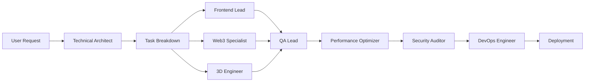

# ROKO Network Marketing Site - Agent Team

## 🤖 Complete Development Team for Autonomous Project Execution

This directory contains specialized AI agents designed to work together to build and maintain the ROKO Network marketing website. Each agent has specific expertise and responsibilities, following the Claude Code subagent template format.

## 📊 Team Structure

### Leadership & Coordination
- **[roko-technical-architect](./roko-technical-architect.md)** - Chief architect overseeing system design and technology decisions
- **[roko-pmo](./roko-pmo.md)** - Project management and team coordination

### Core Development
- **[roko-frontend-lead](./roko-frontend-lead.md)** - React/TypeScript development and component architecture
- **[roko-web3-specialist](./roko-web3-specialist.md)** - Blockchain integration and smart contract interactions
- **[roko-3d-engineer](./roko-3d-engineer.md)** - Three.js visualizations and WebGL graphics

### Quality & Operations
- **[roko-qa-lead](./roko-qa-lead.md)** - Testing strategy and quality assurance
- **[roko-performance-optimizer](./roko-performance-optimizer.md)** - Performance tuning and Core Web Vitals
- **[roko-security-auditor](./roko-security-auditor.md)** - Security assessment and vulnerability management
- **[roko-devops-engineer](./roko-devops-engineer.md)** - CI/CD, infrastructure, and deployment

### Design & User Experience
- **[roko-ui-ux-designer](./roko-ui-ux-designer.md)** - Design system and user experience

## 🚀 Quick Start for AI Models

To use these agents effectively:

1. **Load the Master Manifest**: Start with `docs/MASTER_PROJECT_MANIFEST.md`
2. **Select Appropriate Agents**: Based on the task, invoke the relevant agent
3. **Parallel Execution**: Use multiple agents concurrently for different aspects
4. **Coordination**: The technical architect and PMO agents coordinate cross-team efforts

## 📋 Agent Capabilities Matrix

| Agent | Primary Tools | Key Responsibilities |
|-------|--------------|---------------------|
| **Technical Architect** | Task, TodoWrite, All tools | System design, technology decisions, team coordination |
| **PMO** | TodoWrite, Read, Write | Project planning, sprint management, risk tracking |
| **Frontend Lead** | Read, Write, MultiEdit, Bash | React components, UI implementation, performance |
| **Web3 Specialist** | Read, Write, Bash, WebSearch | Smart contracts, wallet integration, DAO features |
| **3D Engineer** | Read, Write, Bash, WebSearch | Three.js scenes, shaders, GPU optimization |
| **QA Lead** | Read, Write, Bash, Grep | Test coverage, E2E testing, quality gates |
| **Performance Optimizer** | Read, Write, Bash, Grep | Core Web Vitals, bundle optimization, caching |
| **Security Auditor** | Read, Write, Bash, Grep | Vulnerability assessment, penetration testing |
| **DevOps Engineer** | Read, Write, Bash, Grep | CI/CD, infrastructure, monitoring |
| **UI/UX Designer** | Read, Write, WebSearch | Design system, accessibility, user flows |

## 🔄 Workflow Example

## 📝 Task Delegation Pattern

When starting a new feature:

1. **Technical Architect** reviews requirements and creates architecture
2. **PMO** breaks down into sprints and assigns to agents
3. **UI/UX Designer** provides design specifications
4. **Frontend Lead** implements UI components
5. **Web3 Specialist** handles blockchain features
6. **3D Engineer** creates visualizations
7. **QA Lead** ensures quality standards
8. **Performance Optimizer** validates metrics
9. **Security Auditor** checks vulnerabilities
10. **DevOps Engineer** handles deployment

## 🎯 Project Context

Each agent has access to:
- **Master Manifest**: `docs/MASTER_PROJECT_MANIFEST.md`
- **Requirements**: `docs/REQUIREMENTS_SPECIFICATION.md`
- **UI Specs**: `docs/UI_UX_SPECIFICATIONS.md`
- **Brand Guidelines**: `docs/COLOR_PALETTE_ANALYSIS.md`
- **DAO Specs**: `docs/DAO_GOVERNANCE_SPECIFICATION.md`
- **Governance**: `docs/PROJECT_GOVERNANCE.md`

## 💡 Best Practices

### For Autonomous Development
1. Always start with the Technical Architect for system-level decisions
2. Use parallel agent execution for independent tasks
3. Maintain communication through the PMO agent
4. Follow the Definition of Done from PROJECT_GOVERNANCE.md
5. Ensure all quality gates pass before moving forward

### For Human Developers
1. Review agent outputs before implementation
2. Use agents for specialized knowledge areas
3. Leverage PMO agent for project tracking
4. Coordinate through Technical Architect for integration

## 🔐 Security Note

All agents follow security best practices:
- Input validation on all user data
- Secure coding standards
- Regular security audits
- Compliance with OWASP guidelines

## 📊 Success Metrics

Agents work together to achieve:
- ✅ 80% test coverage
- ✅ Lighthouse score > 95
- ✅ WCAG 2.2 AA compliance
- ✅ LCP < 2.5s, INP < 200ms, CLS < 0.1
- ✅ Zero critical vulnerabilities
- ✅ 99.9% uptime

## 🚦 Status Tracking

Use the PMO agent to track:
- Sprint progress
- Bug reports
- Risk register
- Resource allocation
- Timeline adherence

## 🤝 Contributing

To add new agents:
1. Follow the Claude Code subagent template format
2. Define clear responsibilities and tools
3. Specify communication protocols
4. Include deliverables
5. Update this README

---

**Ready to build?** Invoke the Technical Architect agent to begin system design, or the PMO agent to plan your first sprint!